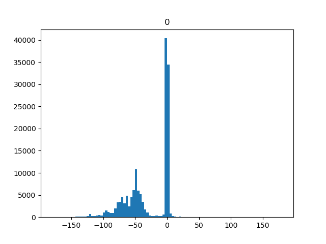

# Human Activity Recognition Using Accelerometry and Gyroscopic Data for Distress Classification

# General Ideas (Add Below):
### - Transfer learning using another acc/gyr trained model. This is an example, lots of work on this out there: https://machinelearningmastery.com/how-to-model-human-activity-from-smartphone-data/

# Distributions for each column in csv files:

